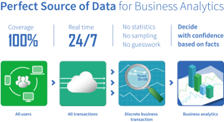

> [!IMPORTANT]
> **This repository is archived and no longer maintained or supported.**
>
> - **Archived:** 2026-10-06
> - **Reason:** AppMon product EOL
> - **Replacement:** None
>
> Preserved for historical and migration reference only. No updates, including security updates, will be provided.
> See the [Dynatrace Archive organization README](https://github.com/Dynatrace-Archive) for usage and security guidance.

## Big Data Business Transaction Bridge

The Big Data Business Transaction Bridge makes it possible to store Business Transaction Results to HDFS, Files, Databases and other stores easily. The results are either written as CSV or JSON files
and can be included in Hive as external tables.

Flume is a distributed service for collecting, aggregating, and moving large amounts of log data. In this case we describe how it can be used to receive data from the dynaTrace [Real Time Business
Transactions Feed](https://community.compuwareapm.com/community/display/DOCDT61/Real+Time+Business+Transactions+Feed) via HTTP Post requests and store it in a Hadoop HDFS or other stores.

Find further information in the [dynaTrace community](https://community.dynatrace.com/community/display/DL/Big+Data+Business+Transaction+Bridge)    

